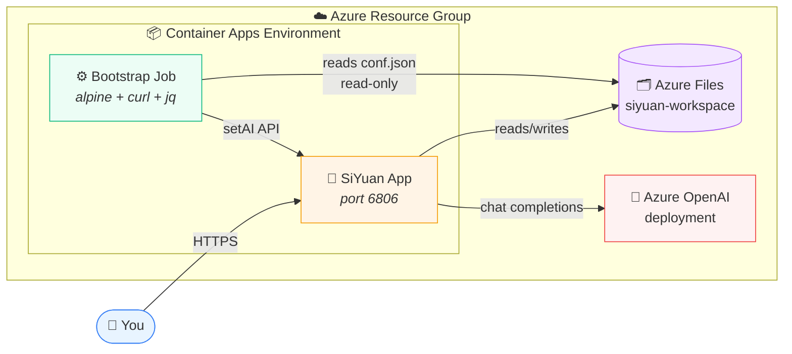

# Xiaoxi: SiYuan on Azure Container Apps

This Terraform project deploys a persistent [SiYuan](https://b3log.org/siyuan/en/) instance on Azure Container Apps and configures its AI provider with an Azure OpenAI deployment.

Take notes. Own your data. Let an AI help you think.

This repository deploys [SiYuan](https://github.com/siyuan-note/siyuan) — a privacy-first, self-hosted note-taking app — onto Azure Container Apps, wires it up to Azure OpenAI, and uses a small bootstrap job to configure the AI backend automatically. Your notes live in Azure Files, so they survive every restart, redeploy, and coffee spill.

## What you get

- **A private SiYuan instance** behind a lock-screen password, reachable over HTTPS
- **Persistent workspace storage** on Azure Files — your notes are not trapped inside a container
- **Azure OpenAI integration** for writing assistance, editing, and agent workflows
- **Hands-off AI configuration** via a one-shot Container App Job
- **A single `terraform apply`** for the whole stack

## How it fits together


## Table of contents

- [Xiaoxi: SiYuan on Azure Container Apps](#xiaoxi-siyuan-on-azure-container-apps)
  - [What you get](#what-you-get)
  - [How it fits together](#how-it-fits-together)
  - [Table of contents](#table-of-contents)
  - [Technical details](#technical-details)
  - [Our learned lessons](#our-learned-lessons)
    - [1. The SiYuan image already knows how to start itself](#1-the-siyuan-image-already-knows-how-to-start-itself)
    - [2. Keep the access code in the environment](#2-keep-the-access-code-in-the-environment)
    - [3. Mount the `conf` subpath, not the whole workspace](#3-mount-the-conf-subpath-not-the-whole-workspace)
    - [4. Use the API token from `conf.json`](#4-use-the-api-token-from-confjson)
    - [5. The small `printf` wrapper is doing important work](#5-the-small-printf-wrapper-is-doing-important-work)
    - [6. Azure Files needs both the network and the mount options](#6-azure-files-needs-both-the-network-and-the-mount-options)
    - [7. SiYuan's AI payload is version-sensitive](#7-siyuans-ai-payload-is-version-sensitive)
    - [8. “Success” still needs a sanity check](#8-success-still-needs-a-sanity-check)
    - [9. Pin the image while you learn its behavior](#9-pin-the-image-while-you-learn-its-behavior)
    - [10. Applying Terraform does not run the job](#10-applying-terraform-does-not-run-the-job)
    - [11. Keep the workload profile names aligned](#11-keep-the-workload-profile-names-aligned)
    - [12. Azure OpenAI availability is more specific than it looks](#12-azure-openai-availability-is-more-specific-than-it-looks)
  - [Prerequisites](#prerequisites)
  - [Configuration](#configuration)
  - [Deploy](#deploy)
  - [Run the AI bootstrap job](#run-the-ai-bootstrap-job)
  - [Troubleshooting](#troubleshooting)
    - [The bootstrap job cannot reach SiYuan](#the-bootstrap-job-cannot-reach-siyuan)
    - [`conf.json` or `api.token` is missing](#confjson-or-apitoken-is-missing)
    - [The Azure OpenAI deployment fails](#the-azure-openai-deployment-fails)
  - [Security and operational notes](#security-and-operational-notes)
  - [Destroy the deployment](#destroy-the-deployment)

## Technical details

`main.tf` creates the following resources in the configured resource group:

- An Azure StorageV2 account with a 10 GB Azure Files share for the SiYuan workspace.
- A virtual network and delegated subnet for the Container Apps environment.
- An Azure Container Apps environment backed by Log Analytics.
- A public SiYuan Container App listening on port `6806`, using `b3log/siyuan:v3.8.5`.
- An Azure OpenAI cognitive account and model deployment.
- A manually triggered Container Apps Job that runs `scripts/bootstrap.sh`.

The bootstrap job waits for SiYuan to become ready, reads the API token from the mounted workspace configuration, and calls SiYuan's AI settings API. The configuration uses the Azure OpenAI-compatible `/openai/v1` endpoint.

## Our learned lessons

These are the things that surprised us while getting the deployment working. We are writing them down so the next person can skip the same debugging cycles—especially before changing the container command, volume mounts, or AI payload.

### 1. The SiYuan image already knows how to start itself

The `b3log/siyuan:v3.8.5` image entrypoint invokes the SiYuan kernel. The Terraform configuration therefore passes the kernel arguments with:

```hcl
args = ["serve", "--workspace=/siyuan/workspace/"]
```

Our first instinct was to replace the entrypoint with `command = ["serve"]`. That did not work reliably because the `b3log/siyuan:v3.8.5` entrypoint already invokes the SiYuan kernel. We now pass the kernel arguments with `args` and leave the entrypoint alone. If you upgrade the image, check its entrypoint before changing this.

### 2. Keep the access code in the environment

We originally experimented with putting the access code in the container arguments. The safer and more stable approach is the `SIYUAN_ACCESS_AUTH_CODE` secret environment variable. It also avoids exposing the secret in deployment metadata or process listings.

### 3. Mount the `conf` subpath, not the whole workspace

The job mounts the Azure Files environment storage at `/siyuan-conf` with `sub_path = "conf"`, so the expected file is:

```text
/siyuan-conf/conf.json
```

Making this mount read-only is intentional. We learned that mounting the whole workspace, choosing the wrong subpath, or starting the job before first boot leads to `conf.json not found` or a missing `api.token`. Let the app initialize once before starting the job.

### 4. Use the API token from `conf.json`

The current bootstrap flow extracts `.api.token` from `conf.json` and sends it as:

```text
Authorization: Token <api-token>
```

We initially tried logging in with the auth code and keeping a cookie. The current flow is simpler: read `.api.token` from `conf.json` and send it as an `Authorization: Token` header. If the token is empty, check initialization, the mount path, and the SiYuan image version first.

### 5. The small `printf` wrapper is doing important work

The job uses Alpine's `/bin/sh -c`, installs dependencies, and then receives the Terraform `file(...)` content as the command's `$0` argument. This is why the command is:

```text
apk add --no-cache curl ca-certificates && printf '%s\n' "$0" | /bin/sh -s
```

This is a slightly non-obvious detail: Terraform passes the `file(...)` content as `$0` to Alpine's `/bin/sh -c`. Changing the command back to `exec /bin/sh -s` means the script is no longer piped into the shell, which produces a confusing startup failure. Keep the wrapper as written.

### 6. Azure Files needs both the network and the mount options

The delegated `Microsoft.App/environments` subnet is needed because Azure Files is mounted through the Container Apps environment. We also found that `nobrl` and `serverino` matter for the workspace mount; removing them can lead to file-locking or inode problems. The workspace should stay writable, while the bootstrap `conf` mount stays read-only.

### 7. SiYuan's AI payload is version-sensitive

The bootstrap script uses the current provider shape: a top-level `providers` array with `apiKey`, `baseURL`, `protocol`, and nested `models`. It is not the older `Provider`/`OpenAI` or `APIKey`/`APIModel` shape. The current endpoint is `${AZURE_OPENAI_ENDPOINT}/openai/v1` (with a trailing slash safely removed before appending the path).

We went through a couple of schema versions before landing on this one. If a request reports success but returns zero providers, the script fails deliberately rather than giving us a false positive. When upgrading SiYuan, check its settings API schema before changing this payload.

### 8. “Success” still needs a sanity check

An HTTP response by itself was not enough to tell us whether the setup worked. The job checks for `"code":0`, verifies that at least one provider came back, and removes API keys before logging the response. The sanitized response in the job logs is the useful diagnostic; never log the raw response.

### 9. Pin the image while you learn its behavior

The deployment pins `b3log/siyuan:v3.8.5` instead of using a floating tag. Entrypoints, authentication, configuration paths, and AI settings can all change between image versions. Before upgrading, check those assumptions and run the bootstrap job against the new image.

### 10. Applying Terraform does not run the job

This caught us once: `terraform apply` creates the bootstrap job, but the job is manual. Also, `scripts/run-job.sh` currently hard-codes `azure-xiaoxi-siyuan-setup` and `rg-siyuan-prod`. If you change `project_name` or `resource_group_name`, update the helper or use the equivalent Azure CLI commands with the generated names.

### 11. Keep the workload profile names aligned

Both the app and job use the `Consumption` workload profile created by the environment. Removing `workload_profile_name = "Consumption"`, or choosing a profile that the environment does not have, can stop deployment or revision creation.

### 12. Azure OpenAI availability is more specific than it looks

The model name, version, deployment name, capacity, and `GlobalStandard` SKU all depend on the region, subscription, and available quota. Terraform can validate successfully while Azure rejects the deployment. Check availability before applying, especially when copying values from `terraform.tfvars.example` or `models.txt`.

## Prerequisites

Install and authenticate the following tools:

- [Azure CLI](https://learn.microsoft.com/cli/azure/install-azure-cli)
- [Terraform](https://developer.hashicorp.com/terraform/install) `>= 1.5.0`

The Azure subscription must allow creation of Container Apps, Azure Files, Log Analytics, Application Insights, and Azure OpenAI resources. The selected Azure OpenAI model, version, deployment SKU, and capacity must also be available in the selected region and subscription.

Sign in and select the target subscription:

```bash
az login
az account set --subscription "<subscription-id-or-name>"
```

## Configuration

Create a private variable file from the example:

```bash
cp terraform.tfvars.example terraform.tfvars
```

On Windows PowerShell, use:

```powershell
Copy-Item terraform.tfvars.example terraform.tfvars
```

At minimum, set these values in `terraform.tfvars`:

```hcl
resource_group_name  = "rg-siyuan-prod"
location             = "swedencentral"
project_name         = "azure-xiaoxi-siyuan"
storage_account_name = "stsiyuanprod001" # globally unique, lowercase, 3-24 characters
siyuan_auth_code     = "<strong-secret>"
timezone             = "Europe/Stockholm"
```

The Azure OpenAI defaults are defined in `variables.tf`. Override `openai_model_name`, `openai_model_version`, `openai_deployment_name`, and `openai_capacity` when using another model or deployment. Verify the exact values with Azure before applying.

## Deploy

From the repository root:

```bash
terraform init
terraform fmt -check
terraform validate
terraform plan -var-file="terraform.tfvars"
terraform apply -var-file="terraform.tfvars"
```

Terraform creates the Container App before the bootstrap job, but the bootstrap job is manual and does not run automatically as part of `terraform apply`.

After applying, display the important outputs:

```bash
terraform output siyuan_url
terraform output azure_openai_endpoint
terraform output azure_openai_deployment
```

Open the value of `siyuan_url` in a browser. Use the `siyuan_auth_code` as the SiYuan access code when prompted.

## Run the AI bootstrap job

The helper script starts the deployed job and follows its logs:

```bash
sh scripts/run-job.sh
```

The script currently targets:

```text
Job:            azure-xiaoxi-siyuan-setup
Resource group: rg-siyuan-prod
```

These values come from the example `project_name` and `resource_group_name`. If either Terraform variable is changed, update `scripts/run-job.sh` accordingly, or run the equivalent commands directly:

```bash
az containerapp job start \
  --name "<project-name>-setup" \
  --resource-group "<resource-group-name>"

az containerapp job logs \
  --name "<project-name>-setup" \
  --resource-group "<resource-group-name>" \
  --follow
```

The job can be run again after changing the AI settings. It has one replica, a 10-minute timeout, and up to three retries.

## Troubleshooting

### The bootstrap job cannot reach SiYuan

Confirm that the Container App is running and inspect its logs:

```bash
az containerapp revision list \
  --name "<project-name>-app" \
  --resource-group "<resource-group-name>" \
  --output table

az containerapp logs show \
  --name "<project-name>-app" \
  --resource-group "<resource-group-name>" \
  --follow
```

The bootstrap script checks `/api/system/version` up to 30 times, waiting 10 seconds between attempts.

### `conf.json` or `api.token` is missing

SiYuan must complete its first startup and initialize the persistent workspace before the job can read the token. Check that the Azure Files share is mounted and that the workspace contains `conf/conf.json`. The job mounts the `conf` subpath read-only at `/siyuan-conf`.

### The Azure OpenAI deployment fails

Model availability varies by region, subscription, version, SKU, and quota. Check the model and deployment options in the Azure portal or Azure CLI, then update the OpenAI variables and run `terraform plan` again.

## Security and operational notes

- Do not commit `terraform.tfvars`; it contains the SiYuan access code. The repository's `.gitignore` excludes it.
- Terraform state can contain sensitive values, including resource secrets. Keep `terraform.tfstate` in protected storage and do not publish it.
- The SiYuan app ingress is externally enabled. Restrict access with Azure networking or an upstream access layer if the instance should not be public.
- The storage account and Azure Files share are created with standard LRS storage. Adjust the Terraform configuration if higher durability or a different access tier is required.

## Destroy the deployment

To remove all resources managed by this configuration:

```bash
terraform destroy -var-file="terraform.tfvars"
```

This deletes the storage account and its workspace data as well, so export or back up the SiYuan workspace first.